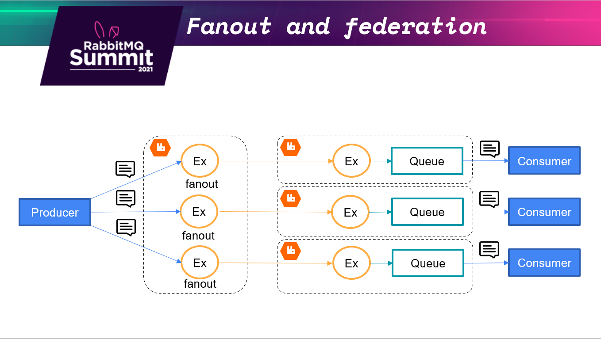
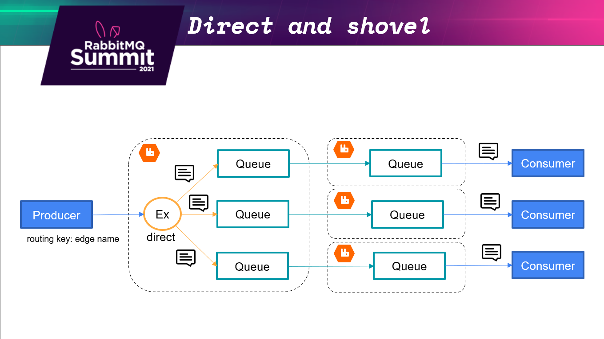

# RabbitMqSummit2021
This solution contains two approaches how to route data between edges. 
## The first approach represents a producer that publishes to a fanout exchange, dedicated to a certain edge.

Steps on how to run the demo solution:
1. Configuration of a cloud RabbitMq instance would require to
  * Create vhost "demo". 
  * Give permission to this vhost.
  * No additional plugins are needed. 
2. Upload source code and navigate to -> Fanout folder of the solution.
3. Configuration of an edge RabbitMq instance would require to
  * Create vhost "demo". 
  * Give permission to this vhost.
  * Enable federation and federation_management plugins.
  * Create federation upstream to cloud from 1.
  * Create policy with pattern ^(edge(uniqueId))$ to federate exchanges only. Examples of policies for different edges ^(edge1)$, ^(edge2)$, ^(edgeN)$   
4. Run RabbitMqSummit2021.EdgeFanout with a proper appsettings.json pointing to the edge RabbitMq instance.
5. Exchanges and queues will be created on the edge RabbitMq as well as the cloud RabbitMq. 
6. Run RabbitMqSummit2021.CloudFanout with a proper appsettings.json pointing to the cloud RabbitMq instance.
7. Input the id of the edge to what message should be delivered. The identifier should be equal to the already configured edge RabbitMq. 
## The second approach represents a producer that publishes to a direct exchange, where a routing key is a unique edge identifier.

Steps on how to run the demo solution:
1. Expand -> Direct folder of the solution.
2. Run RabbitMqSummit2021.CloudDirect with a proper appsettings.json pointing to the cloud RabbitMq cluster.
3. Run RabbitMqSummit2021.EdgeDirect with a proper appsettings.json pointing to the edge RabbitMq instance.

