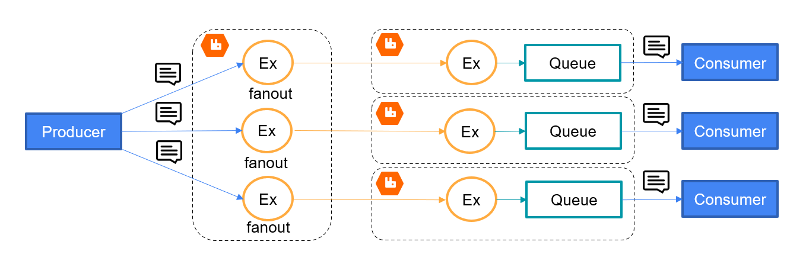

# RabbitMqSummit2021
This solution contains two approaches how to route data between edges. 
## First approach represents a producer that publishes to a fanout exchange, dedicated to a certain edge.

## Second approach represents a producer that publishes to a direct exchange, where a routing key is a unique edge identifier.

